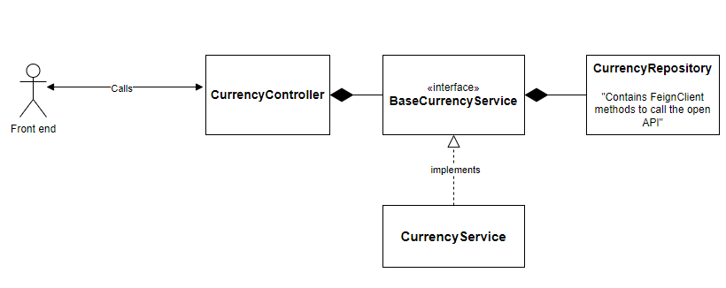

# Currency Graduation Project for Banque Misr Internship

### Project Info 
- Java version : `17`
- Spring version : `3.1.2`
- Dependencies used :
  - Spring Boot Web Dependency
    ```Java
  
     <dependency>
              <groupId>org.springframework.boot</groupId>
              <artifactId>spring-boot-starter-web</artifactId>
     </dependency>
    ```
  - Open Feign Client
    ```Java
    <dependency>
            <groupId>org.springframework.cloud</groupId>
            <artifactId>spring-cloud-starter-openfeign</artifactId>
    </dependency>
    ```
  - Lombok Annotation
    ```Java
    <dependency>
            <groupId>org.projectlombok</groupId>
            <artifactId>lombok</artifactId>
            <optional>true</optional>
    </dependency>
    ```
    
****

### Project UML Diagram

[//]: # (![img.png]&#40;img.png&#41;)


- **CurrencyRepository**: will contain all method for calling the OpenApi for currency conversion using `FeignClient`.
- **BaseCurrencyService** : interface for creating a template for defining methods for dealing with `CurrencyRepository`.
- **CurrencyService** : holds the implementation of the `BaseCurrencyService` and its methods.
- **CurrencyController** : the main controller of our backend service containing all endpoints for accessing our resources and services.

### Open APIs used:
- https://exchangeratesapi.io/documentation/
- https://xecdapi.xe.com/docs/v1/

### APIs Contracts

[//]: # (Will defined later .....)
- **This section will contain all endpoints with all needed information
to make a contract between us as Backend side and Frontend/IOS/Android side to use our services.**
- **Each endpoint will have :**
  - HTTP method.
  - base url.
  - path.
  - parameters -optional-
  - headers -optional-
  - body -in specific methods-
  - sample of each request and response.
  - all possible status codes.

### Swagger Documentation :

[//]: # (Will Add swagger documenation link)
Will added later ...